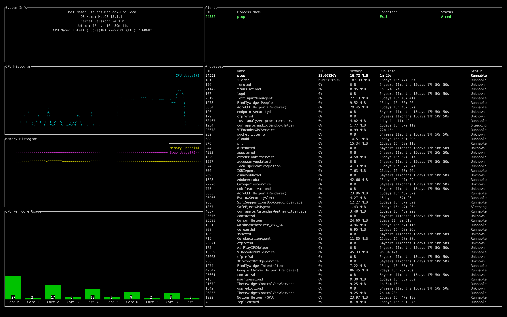

# ptop - Proactive Linux System Monitor and Alert Manager



Team:
- Shizhang Yin, 1002428027, shizhang.yin@mail.utoronto.ca

# Motivation:
System administrators and developers often rely on tools like `top` and `htop` to monitor system performance in real time. While these tools provide valuable insights, they are inherently passive, requiring constant user observation to identify critical issues. Users must manually sift through extensive data, which diverts attention from other tasks and risks delayed responses to potential problems.

This project aims to address these limitations by creating a proactive, customizable monitoring tool for Linux systems that can automatically detect critical issues. By offering real-time, configurable alerts, this tool empowers users to focus on their work without needing to constantly watch for potential issues.

Although several Rust-based CLI tools, such as `bottom`, `ytop`, and `zenith`, have introduced modular designs and visual representations of system data, they focus primarily on static system information and lack proactive, condition-based alerting. This project seeks to fill that gap by developing a Rust-based monitoring tool that notifies users when critical thresholds are reached, as defined by the user.

# Objective:
This project is a command-line interface (CLI) application for Linux that combines detailed system monitoring with real-time alerts based on user-defined conditions. This tool is particularly valuable for users who require real-time monitoring without continuous observation. Additionally, it will provide flexibility for configuring custom alert conditions and thresholds, making it adaptable for diverse use cases.

# Features:
1. **System Information Viewer**:
   - **Overall System Information**:
     - Displays host name, OS name, kernel version, uptime, and CPU type.
   - **CPU Usage Monitoring**:
     - Displays overall CPU usage and per-core usage.
     - Includes a usage histogram, providing users with visual tracking of CPU performance over time.
   - **Memory Usage Monitoring**:
     - Displays both primary memory and swap memory usage.
     - Includes a memory usage histogram for easy trend observation.
   - **Detailed Process Information**:
     - Interactive process table with columns including PID, Name, CPU, Memory, Run Time, and Status.
     - Supports sorting by columns (e.g., CPU, memory usage, or PID) for efficient navigation in ascending and descending order.
     - Supports search filtering processes by typing names.
     - Allows users to terminate processes by sending signals directly from the interface.

2. **Real-Time Alert Detection**:
   - **Proactive Monitoring**: Actively monitors user-defined conditions and triggers alerts when thresholds are exceeded, notifying the user immediately.
   - **Condition Supported**:
        - High CPU or memory usage for a specified process.
        - Unexpected process termination or expected process exit.

3. **Custom Alert Conditions and Thresholds**:
   - Allows users to set and customize alert conditions and thresholds per process.
   - Supports composite conditions, allowing users to specify nuanced criteria critical to their workflow.
   - Provides an alert management system for adding, deleting, viewing, and editing alerts.

# Users' Guide:
There are a bunch of different panes in the application. Here is a brief description of each pane and the features they provide:

- **System Information Viewer**: It provides basic system information such as host name, OS name, kernel version, uptime, and CPU type.

- **CPU Histogram**: It provides a histogram of average CPU usage over time over all cores.

- **Memory Histogram**: It provides a histogram of average memory and swap usage over time.

- **CPU Per Core Usage**: It provides a live updating bar chart of CPU usage.

- **Process Table**: It provides a table of all the processes running on the system, with columns including PID, name, CPU usage, Memory usage and status.

- **Alert Table**: It provides a table of all the alerts that have been set up, and shows status of each alert.

Keyboard Shortcuts:
- `q`: Quit the application.
- `h`: Show help information.
- `j`/`k`: Navigate through the process table.
- `t`: Terminate a process.
- `Enter`: Confirm an input.
- `↑`/`↓`: Navigate through the alert table.
- `/`: Filter the process table.
- `1`/`2`/`3`/`4`/`5`/`6`: Sort the process table by PID, name, CPU usage, memory usage, run time, and status. (Can be pressed multiple times to toggle between ascending and descending order)
- `c`: Set a CPU threshold alert. (In percent CPU usage)
- `m`: Set a memory threshold alert. (In percent memory usage)
- `e`: Set an exit alert.
- `a`: Re-arm an alert.
- `d`: Disarm an alert.
 
# Reproducibility Guide:
The tool can be run by running the following command:
```
git clone https://github.com/tech4me/ptop
cd ptop
cargo run --release
```

# Known limitations:
- The program is more computationally intensive than desired
- Keyboard shortcuts are not intuitive and cannot be customized
- The help menu is not yet implemented
- Input validation is currently limited
- Alert conditions are limited to CPU usage, memory usage, and process exit events
- The program has only been tested on Unix-like systems

# Contribution:
The project is fully conceptualized and implemented by Shizhang Yin.

# Lessons Learned:
Coming from a C++ programming background, many of Rust's programming concepts were familiar. However, Rust offers several features that I've grown to appreciate:
- The Cargo package manager is a game-changer, simplifying dependency management and build systems. Finding and incorporating packages into projects is straightforward, eliminating concerns about build flags and dependency configurations.
- Rust encourages safe and correct code through conservative programming practices. Often, code that compiles works correctly to some extent. The move/borrow system is the default, while copying must be explicitly specified, making it easier to identify unnecessary copies and optimize performance.
- Documentation is consistently available and standardized through the crate system. Every crate includes comprehensive documentation, eliminating the need to read source code to understand library usage.

# Video Demo
https://github.com/tech4me/ptop/blob/main/video_demo.mp4
